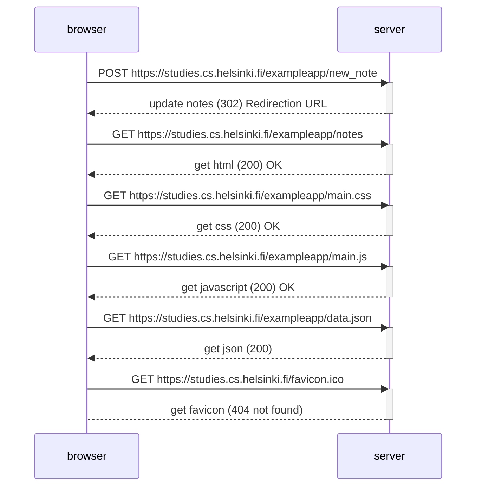

<!-- Exercise: Notes Save and then sequence of Events. -->

```mermaid
sequenceDiagram
    participant browser
    participant server

# Posting new note
browser->>server: POST https://studies.cs.helsinki.fi/exampleapp/new_note
activate server
server-->>browser: update notes (302) Redirection URL
deactivate server

# Refreshing Page
# Get html
browser->>server: GET https://studies.cs.helsinki.fi/exampleapp/notes
activate server
server-->>browser: get html (200) OK
deactivate server

# Get css
browser ->>server: GET 	https://studies.cs.helsinki.fi/exampleapp/main.css 
activate server
server -->>browser: get css (200) OK 
deactivate server

# Get js
browser ->>server: GET 	https://studies.cs.helsinki.fi/exampleapp/main.js
activate server
server -->>browser: get javascript (200) OK
deactivate server

# Get JSON
browser ->>server: GET https://studies.cs.helsinki.fi/exampleapp/data.json
activate server
server -->>browser: get json (200)
deactivate server

# Get favicon
browser ->>server: GET https://studies.cs.helsinki.fi/favicon.ico
activate server
server-->browser: get favicon (404 not found)
deactivate server


```