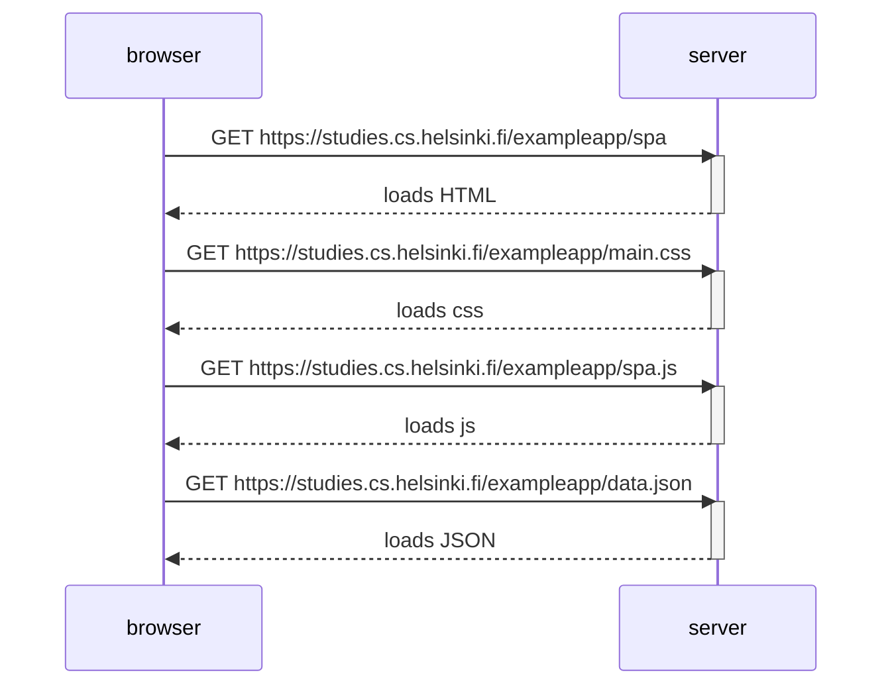

# Notes
Single Page Applications (SPA) do not do redirects / refresh the page when there's new data. SPA sets the stage (html) and then fetches the data using javascript (which hacks into the default behavior of refreshing the page and just injects the new data). 

# Process
- loads the html
- loads the css
- loads the js
- loads the json 

